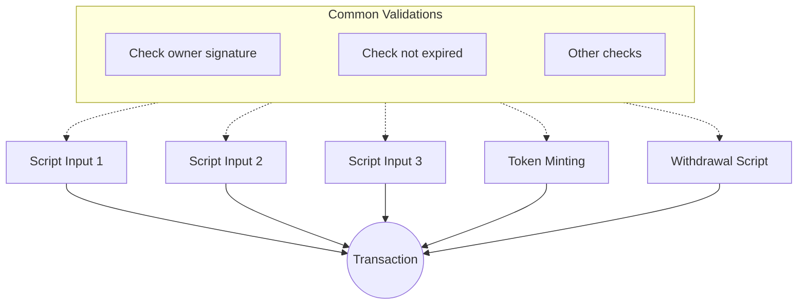
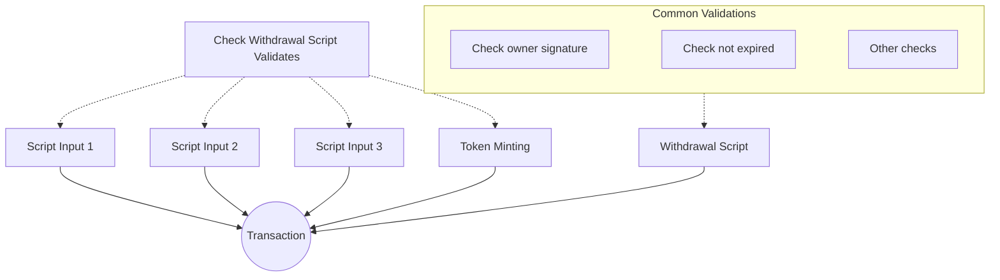

import Link from "fumadocs-core/link";

## Learning Objectives

By the end of this lesson, you will be able to:

- Identify redundant validation patterns in multi-script transactions
- Implement validation delegation using withdrawal scripts
- Use the "withdraw 0 trick" to trigger validation efficiently
- Reduce transaction costs by centralizing common checks
- Structure contracts for maintainability and efficiency

## Prerequisites

Before starting this lesson, ensure you have:

- Completed <Link href="/resources/cardano-course/04-contract-testing">Lesson 4: Contract Testing</Link>
- Understanding of minting, spending, and withdrawal scripts
- Familiarity with the Transaction structure

## Key Concepts

### The Redundancy Problem

Complex transactions often involve multiple scripts validating the same conditions:

```
Transaction with multiple scripts
  Minting Script    -> Checks: owner signed, not expired, valid state
  Spending Script 1 -> Checks: owner signed, not expired, valid state
  Spending Script 2 -> Checks: owner signed, not expired, valid state
  Spending Script 3 -> Checks: owner signed, not expired, valid state
```

Each script independently verifies the same conditions, leading to:

- **Increased execution units**: Same checks run multiple times
- **Higher fees**: More computation costs more ADA
- **Maintenance burden**: Logic duplicated across validators
- **Bug risk**: Inconsistent implementations across scripts

### The Solution: Validation Delegation

Centralize common checks in a single validator. Other scripts simply verify that this "master validator" is being executed:

```
Transaction with delegated validation
  Minting Script    -> Checks: withdrawal script validated
  Spending Script 1 -> Checks: withdrawal script validated
  Spending Script 2 -> Checks: withdrawal script validated
  Withdrawal Script -> Checks: owner signed, not expired, valid state
```

Common validations run once, regardless of how many scripts are involved.

## Step 1: Understand the Architecture

### Before: Redundant Checks



Every script performs the same common validations independently.

### After: Centralized Validation



Other scripts only check that the withdrawal script is being validated. The withdrawal script performs all common checks once.

## Step 2: Implement the Withdrawal Validator

Use the complex withdrawal contract from Lesson 4 as your central validator. This script contains all the business logic.

```rs
// This is the same validator from Lesson 4
// It handles all the complex validation logic
validator complex_withdrawal_contract(oracle_nft: PolicyId) {
  withdraw(redeemer: MyRedeemer, _credential: Credential, tx: Transaction) {
    // ... all validation logic here
  }

  publish(_redeemer: Data, _credential: Certificate, _tx: Transaction) {
    True
  }

  else(_) {
    fail @"unsupported purpose"
  }
}
```

## Step 3: Create Delegating Spending Script

Create a spending validator that delegates validation to the withdrawal script:

```rs
use aiken/crypto.{ScriptHash}
use cardano/transaction.{OutputReference, Transaction}
use cocktail.{withdrawal_script_validated}

validator spending_logics_delegated(
  delegated_withdrawal_script_hash: ScriptHash,
) {
  spend(
    _datum_opt: Option<Data>,
    _redeemer: Data,
    _input: OutputReference,
    tx: Transaction,
  ) {
    withdrawal_script_validated(
      tx.withdrawals,
      delegated_withdrawal_script_hash,
    )
  }

  else(_) {
    fail @"unsupported purpose"
  }
}
```

### How It Works

| Component | Purpose |
|-----------|---------|
| `delegated_withdrawal_script_hash` | Parameter: hash of the withdrawal script to check |
| `withdrawal_script_validated` | Checks if the withdrawal script is in `tx.withdrawals` |
| `tx.withdrawals` | List of withdrawal operations in this transaction |

The spending script does not check business logic directly. It only verifies that the withdrawal script is being executed in the same transaction, which means the withdrawal script's validation will run.

## Step 4: Create Delegating Minting Script

Apply the same pattern to minting:

```rs
use aiken/crypto.{ScriptHash}
use cardano/assets.{PolicyId}
use cardano/transaction.{Transaction}
use cocktail.{withdrawal_script_validated}

validator minting_logics_delegated(
  delegated_withdrawal_script_hash: ScriptHash,
) {
  mint(_redeemer: Data, _policy_id: PolicyId, tx: Transaction) {
    withdrawal_script_validated(
      tx.withdrawals,
      delegated_withdrawal_script_hash,
    )
  }

  else(_) {
    fail @"unsupported purpose"
  }
}
```

## Step 5: The Withdraw 0 Trick

### Problem: How to Trigger Withdrawal Validation?

Normally, withdrawal scripts only run when withdrawing stake rewards. But most transactions do not involve staking.

### Solution: Withdraw Zero

The <Link href="https://aiken-lang.org/fundamentals/common-design-patterns#forwarding-validation--other-withdrawal-tricks">"withdraw 0 trick"</Link> triggers a withdrawal script by including a withdrawal of 0 lovelace:

```
Transaction {
  withdrawals: [
    { credential: Script(withdrawal_script_hash), amount: 0 }
  ]
  ...
}
```

This:

1. Triggers the withdrawal script validation
2. Costs minimal extra fees (just the script execution)
3. Does not affect stake rewards
4. Cleanly separates validation logic from script purpose

### Why Withdrawal Scripts?

You could delegate to spending or minting validators instead. However, withdrawal scripts offer advantages:

| Delegation Target | Trigger Method | Drawbacks |
|------------------|----------------|-----------|
| Spending Script | Must spend a UTXO | Requires a UTXO at the script address |
| Minting Script | Must mint/burn an asset | Requires a minting policy in the tx |
| Withdrawal Script | Withdraw 0 | Clean, no side effects |

The withdraw 0 trick provides the cleanest trigger mechanism - it does not require consuming UTXOs or minting tokens.

## Step 6: Off-chain Implementation

When building transactions that use delegating scripts, include the withdrawal:

```ts
import { MeshTxBuilder } from "@meshsdk/core";

const txBuilder = new MeshTxBuilder({
  fetcher: provider,
});

// Include the withdrawal to trigger validation
await txBuilder
  // ... other transaction components
  .withdrawalPlutusScriptV3()
  .withdrawal(withdrawalScriptAddress, "0")  // Withdraw 0 lovelace
  .withdrawalScript(withdrawalScriptCbor)
  .withdrawalRedeemerValue(redeemer)
  // ... rest of transaction
  .complete();
```

## Complete Working Example

### Project Structure

```
delegated-validation/
  validators/
    withdraw.ak      # Central validator with all business logic
    spend.ak         # Delegating spending script
    mint.ak          # Delegating minting script
```

### validators/withdraw.ak

```rs
use aiken/crypto.{VerificationKeyHash}
use cardano/address.{Address, Credential}
use cardano/assets.{PolicyId}
use cardano/certificate.{Certificate}
use cardano/transaction.{Transaction}
use cocktail.{
  input_inline_datum, inputs_at_with_policy, inputs_with_policy, key_signed,
  output_inline_datum, outputs_at_with_policy, valid_before,
}

pub type OracleDatum {
  app_owner: VerificationKeyHash,
  app_expiry: Int,
  spending_validator_address: Address,
  state_thread_token_policy_id: PolicyId,
}

pub type SpendingValidatorDatum {
  count: Int,
}

pub type MyRedeemer {
  ContinueCounting
  StopCounting
}

validator central_validator(oracle_nft: PolicyId) {
  withdraw(redeemer: MyRedeemer, _credential: Credential, tx: Transaction) {
    // All business logic centralized here
    let Transaction {
      reference_inputs,
      inputs,
      outputs,
      mint,
      extra_signatories,
      validity_range,
      ..
    } = tx

    expect [oracle_ref_input] = inputs_with_policy(reference_inputs, oracle_nft)
    expect OracleDatum {
      app_owner,
      app_expiry,
      spending_validator_address,
      state_thread_token_policy_id,
    } = input_inline_datum(oracle_ref_input)

    let is_app_owner_signed = key_signed(extra_signatories, app_owner)

    when redeemer is {
      ContinueCounting -> {
        // ... validation logic
        is_app_owner_signed? && valid_before(validity_range, app_expiry)?
      }
      StopCounting -> {
        is_app_owner_signed?
      }
    }
  }

  publish(_redeemer: Data, _credential: Certificate, _tx: Transaction) {
    True
  }

  else(_) {
    fail @"unsupported purpose"
  }
}
```

### validators/spend.ak

```rs
use aiken/crypto.{ScriptHash}
use cardano/transaction.{OutputReference, Transaction}
use cocktail.{withdrawal_script_validated}

validator delegating_spend(central_validator_hash: ScriptHash) {
  spend(
    _datum_opt: Option<Data>,
    _redeemer: Data,
    _input: OutputReference,
    tx: Transaction,
  ) {
    withdrawal_script_validated(tx.withdrawals, central_validator_hash)
  }

  else(_) {
    fail @"unsupported purpose"
  }
}
```

### validators/mint.ak

```rs
use aiken/crypto.{ScriptHash}
use cardano/assets.{PolicyId}
use cardano/transaction.{Transaction}
use cocktail.{withdrawal_script_validated}

validator delegating_mint(central_validator_hash: ScriptHash) {
  mint(_redeemer: Data, _policy_id: PolicyId, tx: Transaction) {
    withdrawal_script_validated(tx.withdrawals, central_validator_hash)
  }

  else(_) {
    fail @"unsupported purpose"
  }
}
```

## Key Concepts Explained

### Benefits of Validation Delegation

| Benefit | Description |
|---------|-------------|
| **Efficiency** | Common checks execute once instead of N times |
| **Lower Costs** | Reduced execution units means lower fees |
| **Maintainability** | Single source of truth for validation logic |
| **Consistency** | Impossible to have divergent validation between scripts |

### When to Use This Pattern

Use validation delegation when:

- Multiple scripts share common validation requirements
- Transaction costs are a concern
- You want centralized control over validation logic
- The protocol involves complex multi-script interactions

### When NOT to Use This Pattern

Avoid this pattern when:

- Scripts have completely independent validation logic
- Simplicity is more important than optimization
- You need each script to be self-contained

## Exercises

1. **Add a second redeemer**: Extend the central validator to handle a third action type. Verify that the delegating scripts do not need changes.

2. **Multiple delegation levels**: Create a hierarchy where spending scripts delegate to a minting script, which delegates to a withdrawal script.

3. **Measure the savings**: Build the same transaction with and without delegation. Compare the execution units and fees.

## Next Steps

You have learned:

- Why redundant validation is costly
- How to centralize validation in a withdrawal script
- The "withdraw 0 trick" for clean validation triggering
- How to implement delegating spending and minting scripts

In the next lesson, you learn how to <Link href="/resources/cardano-course/06-interpreting-blueprint">interpret Aiken blueprints</Link> and generate off-chain code automatically.

## Related Links

- <Link href="https://aiken-lang.org/fundamentals/common-design-patterns#forwarding-validation--other-withdrawal-tricks">Aiken Design Patterns: Withdraw 0 Trick</Link>
- <Link href="https://github.com/sidan-lab/vodka">Vodka Library</Link>
- <Link href="/apis/txbuilder">MeshTxBuilder API Reference</Link>
